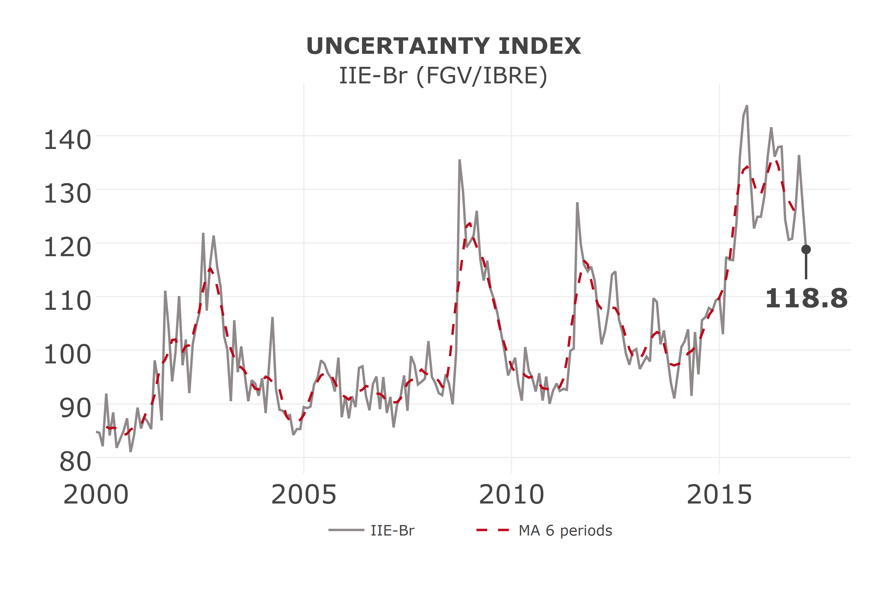
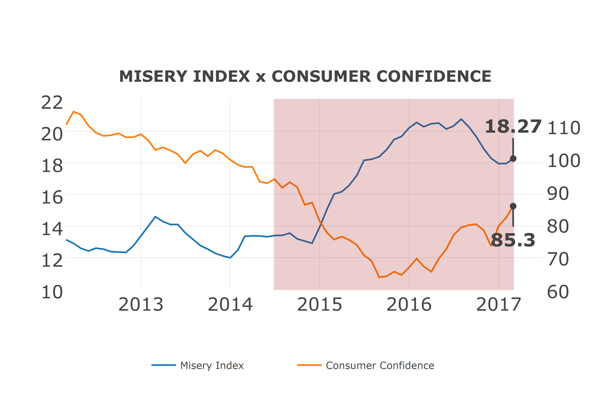

Discutiremos aqui algumas formas básicas de uso do pacote BETS,
mostrando algumas de suas principais funções. O BETS disponibiliza
milhares de séries econômicas brasileiras de diferentes centros, como
Banco Central, IBGE e FGV. Mas, além disso, contém ferramentas de
análise e visualização de séries temporais, como veremos.

Interface com a Base de Dados
-----------------------------

### BETS.search

Devido ao tamanho considerável da base de dados, foi necessário criar um
modo de pesquisar por séries a partir de seus metadados, isto é, uma
ferramenta de busca que utilizasse uma ou mais informações das séries
como palavras-chave. A função `BETS.search` realiza as pesquisas por
cada campo da tabela de metadados

O protótipo da `BETS.search` tem a forma:

    BETS.search(description, src, periodicity, unit, code, view = TRUE, lang = "en")

Onde os argumentos recebem, respectivamente:

-   `description`: um `character`. *String* de busca com os termos que
    devem ou não estar presentes na descrição da série desejada.
-   `src`: um . A fonte dos dados.
-   `periodicity` um `character`. A frequência na qual a série
    é observada.
-   `unit`: um `character`. A unidade na qual os dados foram medidos.
-   `code`: um `integer`. O código único da série na base do `BETS`.
-   `view`: um `boolean`. Por padrão, `TRUE`. Se `FALSE`, os resultados
    serão mostrados direto no console do R.
-   `lang`: um `character`. Idioma da pesquisa. Por padrão, `'en'`,
    para inglês. Também é possivel fazer a pesquisa em português,
    bastando mudar o valor para `'pt'`.

Para refinar as buscas, há regras de sintaxe para o parâmetro
`description`:

1.  Para procurar palavras alternativas, separe-as por espaços
    em branco. Exemplo: `description = 'núcleo ipca'` significa que a
    descrição da série deve conter `'ipca'` **e** `'núcleo'`.

2.  Para procurar expressões inteiras, basta cercá-las com `' '`.
    Exemplo: `description = 'índice de 'núcleo ipca''` significa que
    deve conter na descrição da série `'núcleo ipca'` **e** `'índice'`.

3.  Para excluir palavras da busca, insira um ∼ antes de cada um delas.
    Exemplo: `description = 'ipca $\sim$ núcleo'` significa que a
    descrição da série deve conter `'ipca'` e **não** pode conter
    `'núcleo'`.

4.  Para excluir todas as expressões da busca, de forma semelhante ao
    item anteiror, basta cercá-los com `' '` e inserir um ∼ antes de
    cada uma delas. Exemplo:
    `description = '$\sim$ índice 'núcleo ipca''` significa que a
    descrição da série deve conter `'índice'` e **não** pode conter
    `'núcleo ipca'`.

5.  É possível pesquisar ou negar várias palavras ou expressões, desde
    que sejam respeitadas as regras precedentes.

6.  O espaço em branco após o sinal de negação (∼) não é necessário. Mas
    os espaços em branco depois de expressões ou palavras
    são necessários.

Alguns exemplos de uso podem ser visto abaixo:

    > BETS.search(description = "sales ~ retail")
    > BETS.search(description = "'sales volume index' ~ vehicles")
    > BETS.search(description = "'distrito federal'", periodicity = 'A', src = 'IBGE')

    > BETS.search(description = "gdp accumulated", unit = "US", view = F)

    ##   code                                            description
    ## 1 4192 GDP accumulated in the last 12 months - in US$ million
    ## 2 4386           GDP accumulated in the year - in US$ million
    ##            unit periodicity      start last_value    source
    ## 1 US$ (million)           M 31/01/1990   may/2017 BCB-Depec
    ## 2 US$ (million)           M 31/01/1990   may/2017 BCB-Depec

    > results = BETS.search(description = "consumption ~ 'seasonally adjusted' ~ private", view = F)
    > head(results)

    ##   code                                           description
    ## 1 1393          Petroleum derivatives consumption - Gasoline
    ## 2 1394               Petroleum derivatives consumption - GLP
    ## 3 1395          Petroleum derivatives consumption - Fuel oil
    ## 4 1396        Petroleum derivatives consumption - Diesel oil
    ## 5 1397 Petroleum derivatives consumption - Other derivatives
    ## 6 1398 Petroleum derivatives consumption - Total derivatives
    ##                     unit periodicity      start last_value source
    ## 1 Barrels/day (thousand)           M 31/01/1979   apr/2017    ANP
    ## 2 Barrels/day (thousand)           M 31/01/1979   apr/2017    ANP
    ## 3 Barrels/day (thousand)           M 31/01/1979   apr/2017    ANP
    ## 4 Barrels/day (thousand)           M 31/01/1979   apr/2017    ANP
    ## 5 Barrels/day (thousand)           M 31/01/1979   apr/2017    ANP
    ## 6 Barrels/day (thousand)           M 31/01/1979   apr/2017    ANP

Para mais informações sobre a `BETS.search`, incluindo os valores
válidos em cada campo, consulte o manual de referência, digitando
`?BETS.search` no console do R.

BETS.get}
---------

A `BETS.get` funciona unicamente através do código de referência da
série, obtido com as consultas feita com a . Sua assinatura é:

    BETS.get(code, data.frame = FALSE)

O parâmetro `code` é, obviamente, obrigatório. O argumento opcional
`data.frame` representa o tipo do objeto que será retornado. Por padrão,
seu valor é `FALSE`, indicando que o objeto devolvido pela função será
um `ts` (*time series*). Caso `data.frame = TRUE`, a série será
armazenada em um objeto do tipo `data.frame`.

Vamos extrair duas das séries pesquisadas anteriormente.

    > # Obter a serie do PIB acumulado em 12 meses, em dolares
    > gdp_accum = BETS.get(4192)
    > window(gdp_accum, start = c(2014,1))

    ##          Jan     Feb     Mar     Apr     May     Jun     Jul     Aug
    ## 2014 2472533 2481284 2481924 2479634 2480629 2475636 2471898 2465860
    ## 2015 2403690 2349150 2301000 2246336 2189805 2141042 2085474 2029582
    ## 2016 1792830 1792407 1788570 1787263 1786178 1788167 1786639 1789734
    ## 2017 1815461 1830139 1848533 1864606 1879933 1895371                
    ##          Sep     Oct     Nov     Dec
    ## 2014 2465907 2462505 2457480 2454846
    ## 2015 1970754 1911276 1854424 1797601
    ## 2016 1791403 1790562 1794418 1799436
    ## 2017

    > # Obter a serie do PIB do Distrito Federal, a precos de mercado
    > gdp_df = BETS.get(23992, data.frame = T)
    > head(gdp_df)

    ##         date       value
    ## 1 2002-01-01 53902199799
    ## 2 2003-01-01 58456124319
    ## 3 2004-01-01 67076505202
    ## 4 2005-01-01 75732681210
    ## 5 2006-01-01 84661405538
    ## 6 2007-01-01 93404000766

BETS.save
---------

Para conferir versatilidade às formas de armazenamento das séries do ,
há a possibilidade de criar arquivos com as séries em formatos
proprietários, isto é, formatos que pertencem a *softwares* pagos.

A `BETS.save` extrai a série temporal da base de dados do pacote na
forma de um `data.frame` e cria um arquivo no formato especificado. No
arquivo, há uma tabela onde a primeira coluna conterá as datas e a
segunda, os dados.

A função possui três variações:

    BETS.save.sas(code, data = NULL, file.name = "series")
    BETS.save.spss(code, data = NULL, file.name = "series")
    BETS.save.stata(code, data = NULL, file.name = "series")

Novamente, o parâmetro `code` recebe o código da série. O usuário pode
fornecer sua própria série através do argumento `data`, que pode ser um
`data.frame` ou um `ts`. Não é necessário acrescentar a extensão ao nome
do arquivo no parãmetro `file.name`.

Alguns exemplos típicos de uso seriam:

    > # Salvar a série da dívida pública líquida no formato padrão do Excel
    > BETS.save.stata(code = 2078, file.name = "series_stata.dta")
    > 
    > # Salvar uma série qualquer no formato do SPSS
    > BETS.save.spss(data = myseries, file.name = "series_spss")

BETS.chart
----------

A `BETS.chart` foi inicialmente projetada para ser uma função privada,
auxiliar da `BETS.dashboard`. No entanto, pensamos ser de grande valia
para o usuário dispor de um meio de obter os gráficos dos *dashboard*s
separadamente, de modo a poder incorporá-los em seus trabalhos.

O protótipo da `BETS.chart` é o que se segue:

    BETS.chart(ts, file = NULL, open = TRUE, params = NULL)

O parâmetro `ts` pode receber uma dentre as várias opções pré-definidas
de gráficos ou uma série do usuário. Há também a opção de salvar a saída
no *working directory*, definindo o nome do arquivo `file`. Caso o
arquivo deva ser aberto após a criação, `open` deve ser mantido como
`TRUE`. O parâmetro `params` é reservado para gráficos de séries do
usuário. É uma lista que pode conter o campo `codace`, que recebe um
booleano e indica se devem ser desenhadas áreas sombreadas representando
recessões datadas pelo CODACE (FGV/IBRE), e o campo `start`, que
especifica qual deve ser a data de início da série. Uma vez que se
tratam de gráficos de conjuntura, a data de fim não pode ser alterada e
é sempre o último dado disponível.

Vejamos dois exemplos de uso da `BETS.chart`.

    > BETS.chart(ts = 'iie_br', file = "iie_br", open = TRUE)

{ width=60% }

    > BETS.chart(ts = "misery_index", file = "misery_index.png", open = TRUE)

{ width=60% }

Para uma lista completa dos gráficos diponíveis, consulte o manual de
referência da `BETS.chart`.

BETS.dashboard
--------------

O `BETS` possui uma poderosa ferramenta de análise de conjuntura, os
*dashboards*. Para criar um *dashboard*, chamamos a `BETS.dashboard`,
cuja assinatura é:

    BETS.dashboard(type = "business_cycle", saveas = NA)

Assim, obtemos um arquivo *.pdf*. No exemplo, o usuário escolhe salvar o
arquivo com o nome de *survey.pdf*. Os gráficos que são exibidos também
são de escolha do usuário, selecionados através do parâmetro `charts`
(por *default*, seu valor é `'all'`). O manual de referência possui uma
lista completa dos gráficos disponíveis.

    > BETS.dashboard(type = "business_cycle", saveas = "survey.pdf")

