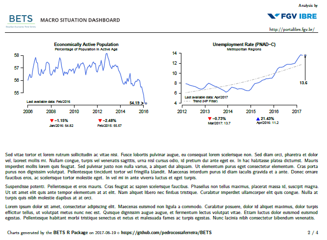
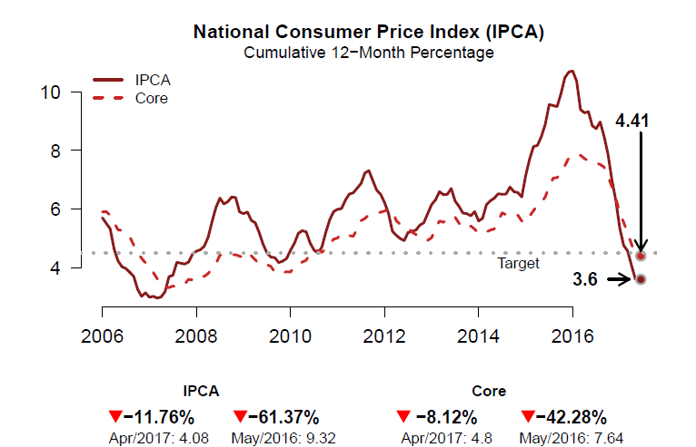
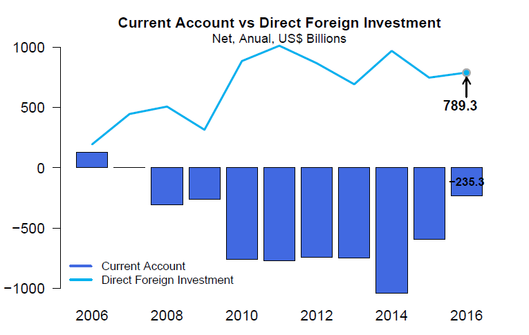
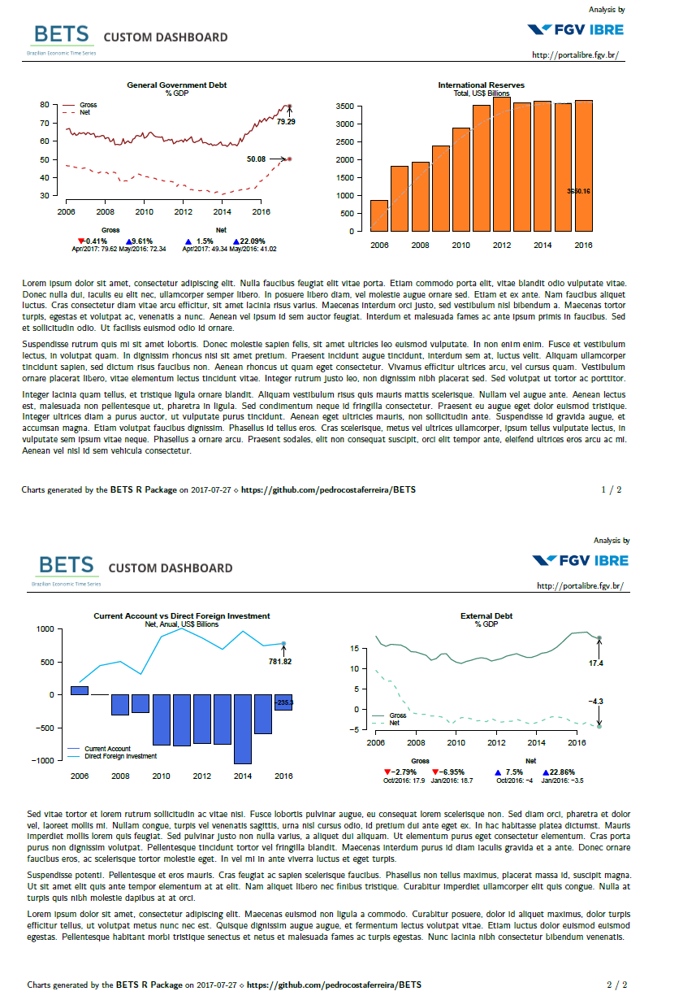

The BETS package, besides providing thousands of Brazilian economic time series and interesting analytical tools, has a powerful device to visualize economic data. With a few lines of code - in some cases, only one line - the user is able to create professional looking dashboards exhibiting several thematic charts. These charts will always contain the latest available data of each series, since BETS extracts series directly from their original sources. The figure below shows a page of one of such dashboards:

```{r fig.align='center', echo=F}
knitr::include_graphics("dashboard.png")
```

In this example, we used a built-in theme - all charts inform something about the Brazilian business cycles. However, dashboards are fully customizable and charts are not constrained to BETS series. In fact, the user can feed any time series in, as we are going to demonstrate later on. 

To create the dashboard we have just shown, run the following command:

```{r eval = F}
BETS.dashboard(type = "business_cycle", saveas = "survey.pdf")
```

The parameter `saveas` is not required, but it is useful to know that you can save dashboards anywhere you want to. You can download `survey.pdf` here. 

Now, let's take another step in the customization direction. One of the nice features of BETS dashboards is allowing the user to incorporate text (e.g. a textual analysis). To do this, you have to provide an external `.txt` file with your text, obeying two simple synthax rules (separate paragraphs with '\\\\n' and pages with '##'). If you provide a text, authoring will be required. You can also add your company logo or your email. The next code snippet shows how to do it. 

```{r eval = F}
parameters = list(author = "FGV/IBRE", 
                  url = "http://portalibre.fgv.br/",
                  text = "text.txt",
                  logo = "logo_ibre.png")

BETS.dashboard(type = "macro_situation", parameters = parameters)
```

Here we used another built-in theme: `macro_situation` (for macroeconomic situation charts). The result of this straightforward call is, again, a `.pdf` file. One of its pages is displayed below.

```{r fig.align='center', echo=F}

```

You might be wondering how to insert your own series into BETS dashboards. Firstly, we have to look into the main constituents of BETS dashboards: BETS charts. The BETS function to create those charts is `BETS.chart`, which is internally called by `BETS.dashboard`, but is also part of BETS' public API. 

### Using BETS.chart 

As detailed in the help files, `BETS.chart` accept many predefined series, as well as custom series (that is, `ts` objects representing any time series). For instance, suppose you want to observe the evolution of the uncertainty level of the Brazilian economy. Then, all you have to do is to run this command:

```{r eval = F}
BETS.chart(ts = "iie_br", file = "uncertainty.png", open = T)
```

Parameter `ts` receives *iie_br*, which is the code for the Economic Uncertainty Index of the Getúlio Vargas Foundation. The fuction saves the chart in file *uncertainty.png* and opens it to the user. Results are reproduced below.

```{r, out.width = '70%', fig.align='center', echo=F}
knitr::include_graphics("iie_br.png")
```

All available codes are listed in the help files. To access them, type `?BETS.chart` in the R console. You will see that chart's codes are divided into two categories, *Business Cycle Dashboard ('plotly' style)* and *Macroeconomic Situation Dashboard ('normal' style)*, referring to the dashboards they belong to and the style in which they are drawn. The Uncertainty Index chart is rendered using the package `plotly`, but the National Consumer Price Index chart is created with default R plotting functions (`normal` style). 

The call to create the National Consumer Price Index chart is simply

```{r eval = F}
BETS.chart("ipca_with_core", file = "cpi.pdf")
```

Note that this time we specified that the file should be a `.pdf` instead of a `.png`. Both formats are accepted. Nevertheless, it is reccomended that *plotly* charts be saved in `.png` files and *normal* charts in *.pdf* files, for better resolution.

The command just presented renders the follwing figure:

```{r, out.width = '70%', fig.align='center', echo=F}

```

It is also possible to provide external time series (i.e. not predefined). Let's make a Brazilian current account and direct foreign investment chart. You will see how simple it is to create beautiful, clean and informative custom charts with BETS. Further on, we are going to explain how to include them in custom dashboards. 

```{r eval = F}
##-- Get the series from the BETS database 

# Current Account, from 2006 on, in USD billions
curr_acnt <- window(BETS.get(23461), start = 2006)/100

# Direct Foreign Investment, from 2006 on, in USD billions
dir_inv <-  window(BETS.get(23645), start = 2006)/100

##-- Set chart parameters and call BETS.chart
params <- list(
    type = "bar",
    title = "Current Account vs Direct Foreign Investment",
    subtitle = "Net, Anual, US$ Billions",
    colors = c("royalblue","deepskyblue2"),
    extra = dir_inv,
    legend.pos = "bottomleft",
    legend = c("Current Account","Direct Foreign Investment"),
    extra.arr.ort = 'v',
    extra.arr.len = 200
)

BETS.chart(ts = curr_acnt, style = "normal", file = "ca_di.pdf", open = T, params = params)
```

```{r, out.width = '70%', fig.align='center', echo=F}

```

Most chart parameters are self-explanatory, but others deserve clarification. `extra` receives the second series and will always be plotted as a line; `extra.arr.ort` is the orientation of the arrow pointing to the last value of the second ("extra") series (you can also set this for the main series, using `arr.ort`) and `extra.arr.len` is the length of this arrow (likewise, there is a `arr.len` parameter).

We are now ready to build a custom dashboard. You will notice you don't even have to call `BETS.chart` - `BETS.dashboard` will do the job. 

### Using BETS.dashboard to create a custom dashboard

First of all, we have to create two empty lists. They will contain the series and the setups of the graphs.

```{r eval = F}
charts <- list()
charts.opts <- list()
```

Then, we configure the parameters of each graph inside these lists.

```{r eval = F}
##-- General Government Debt

# The elements of 'charts' will be the series to be plotted
charts[[1]] <- window(BETS.get(4537),start = c(2006,1))

# The elements of 'charts.opts' will be the setups of the graphs
charts.opts[[1]] <- list(
    type = "lines",
    title = "General Government Debt",
    arr.len = 6,
    ylim = c(30,82),
    subtitle = "% GDP",
    legend = c("Gross", "Net"),
    extra = window(BETS.get(4536),start = c(2006,1)),
    extra.arr.ort = 'h',
    extra.arr.len = 1 
)

# International Reserves
charts[[2]] <- window(BETS.get(3545),start = 2006)/100

charts.opts[[2]] <- list(
    type = "bar",
    title = "International Reserves",
    subtitle = "Total, US$ Billions",
    colors = 'chocolate1',
    trend = T
)

# Current Account vc Direct Foreign Investment
charts[[3]] <- window(BETS.get(23461), start = 2006)/100

charts.opts[[3]] <- list(
    type = "bar",
    title = "Current Account vs Direct Foreign Investment",
    subtitle = "Net, Anual, US$ Billions",
    colors = c("royalblue","deepskyblue2"),
    extra = window(BETS.get(23645), start = 2006)/100,
    legend.pos = "bottomleft",
    legend = c("Current Account","Direct Foreign Investment"),
    extra.arr.ort = 'v',
    extra.arr.len = 200
)

# External Debt

# These series must be edited 
# Their frequency is anual until 1998, then it changes to quarterly
# We remove the anual part and then window the data we need
df <- BETS.get(11407, data.frame = T)
df <- df[-(1:30),2]
charts[[4]] <- window(ts(df, start = c(2000,1), frequency = 4),start = c(2006,1)) 

df <- BETS.get(11409, data.frame = T)
df <- df[-(1:30),2]
extra <- window(ts(df, start = c(2000,1), frequency = 4),start = c(2006,1))

charts.opts[[4]] <- list(
    type = "lines",
    title = "External Debt",
    subtitle = "% GDP",
    colors = c("aquamarine4","aquamarine3"),
    legend = c("Gross", "Net"),
    extra = extra,
    arr.len = 5,
    extra.arr.ort = 'v',
    extra.arr.len = 5,
    legend.pos = "bottomleft"
)
```

Next, we configure other options, such as the style of the graphs, the name of the author (since we will provide a text to accompany the plots), the logo and the website of the enterprise the author works in, and the text with comments about the economic phenomenon we are seeking to explain. These must all be placed inside a list whose elements have pre-defined names (look into `BETS.dashboard` help for a complete listing of these elements and its names).

```{r eval = F}
parameters <- list(
    style = "normal", 
    charts.opts = charts.opts,
    author = "FGV/IBRE", 
    url = "http://portalibre.fgv.br/",
    text = "text2.txt",
    logo = "logo_ibre.png"
)
```

Finally, we call `BETS.dashboard`:

```{r eval = F}
BETS.dashboard(type = "custom", charts = charts, saveas = "custom_dashboard.pdf", parameters = parameters)
```

This call creates a `.pdf` file containing the dashboard. Its two pages are reproduced below.

```{r, out.width = '90%', fig.align='center', echo=F}

```

And that's it! With relatively few lines of code, we were able to design a fully customizable, professional-looking economic dashboard using BETS.
