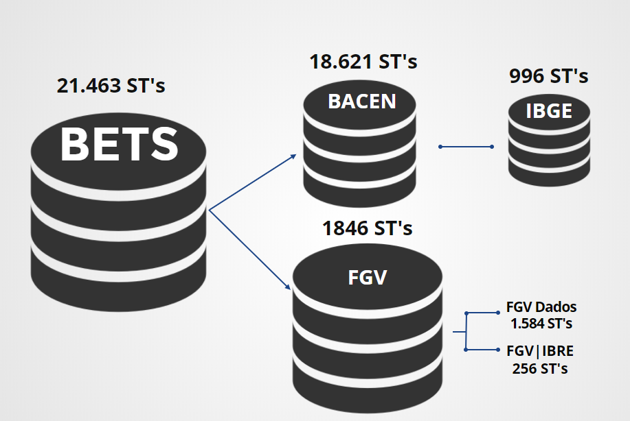
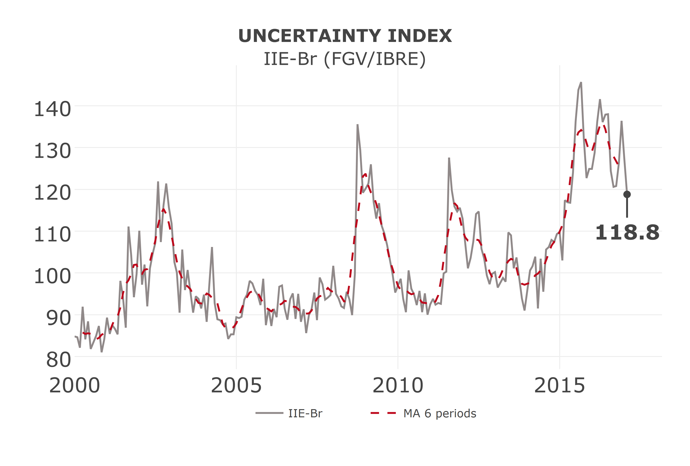
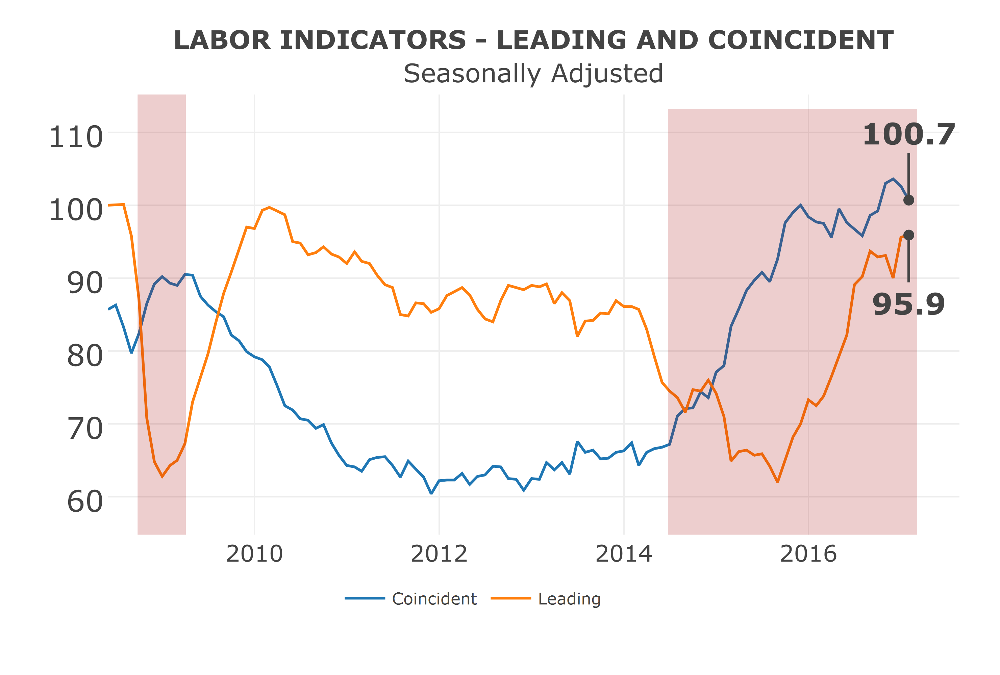
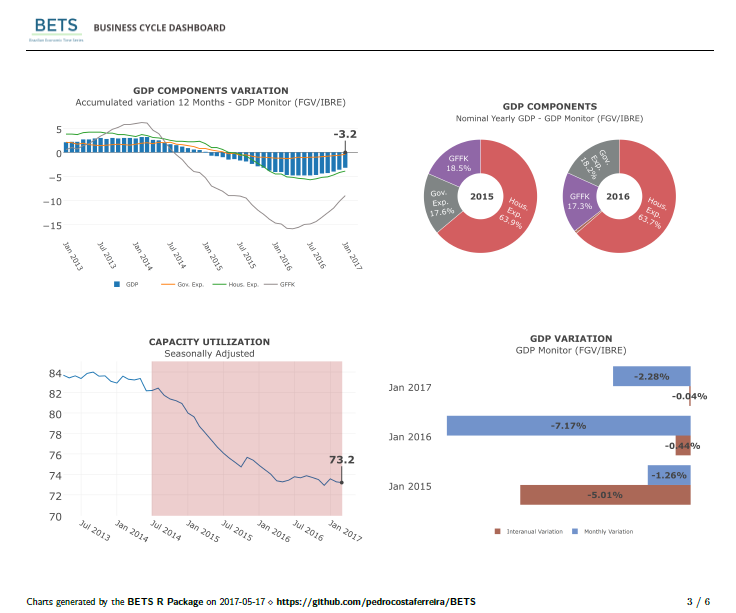
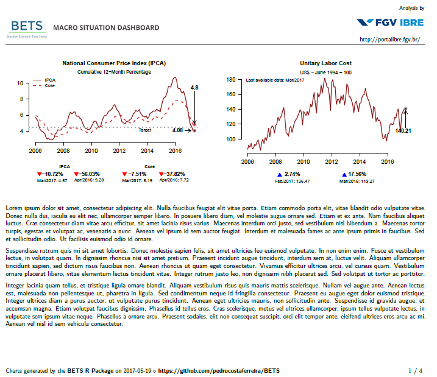

## Introduction

The BETS package (an abbreviation for Brazilian Economic Time Series) for R [@R] allows easy access to the most important Brazilian economic time series and a range of tools for analyzing them. It provides a much-needed single point of access to the many Brazilian series and a simple, flexible and robust interface. 

The series in the BETS database are produced by three important and respected institutions: the Central Bank of Brazil (BACEN), the Brazilian Institute of Geography and Statistics (IBGE) and the Brazilian Institute of Economics at the Fundação Getúlio Vargas (FGV/IBRE and FGV Data). BETS was originally conceived to bring together as many series from these centers as possible in a single place because of the difficulties researchers faced obtaining this information. This objective was achieved and the package now contains more than 18,000 Brazilian economic series. 

Because of the extremely large size of the databases, BETS was expanded to provide mechanisms that would help analysts to search for, extract and export series. The development of the package then took a new direction and BETS was to become an integrated analysis and learning environment. A range of functionality missing from the R universe was included to make modeling and interpretation of the series available in BETS even easier. In addition, some functions already include the option of generating explanatory outputs that encourage and help users to expand their knowledge. 

This article seeks to describe the structure and some of the more important functionality of BETS. Typical examples of how the package can be used are described step by step. In the next section we discuss the database in detail. Then in Section 3 we describe the structure of the package and the different elements it is currently composed of. Section 4 introduces the basic ways in which BETS can be used and shows how users can search for, read and store series. The more advanced functions are also discussed in this section.

## Database \label{banco}

Traditionally, the analyst could obtain the IBRE series in the FGV Data system[^1], which contains all the FGV statistical output and a set of selected indicators from other centers. With BETS it is no longer necessary, since we built a database to store this data and provide access to it. The figure below shows a schematic representation of the BETS database in its current form. 

{ width=400 }

[^1]: FGV Data can be accessed from the IBRE portal at _web_: [Portal IBRE](http://portalibre.fgv.br/).

An important discussion during the conceptual design phase for BETS concerned the location of the database. The option of distributing the data together with the package was discarded as CRAN does not accept very large data files (`.rdas`). This left two alternatives: to collect the data dynamically using the external APIs in the Central Bank of Brazil, IBGE and IBRE systems or to maintain a database with a database management system (DBMS). In its current form, the package implements a hybrid solution. The IBGE and BACEN series are acquired on the fly using the respective APIs. This procedure is not necessary for the FGV/IBRE series as the data are provided directly by the institution, which is supporting the project. These series are kept in a database built using MySQL.

 This division is invisible to the user, who does not need to know which database he should look in and will always have access to the most up-to-date data.[^2] This architecture facilitates implementation and maintenance of the structures and increases the efficiency of the package. The data are updated by a team of maintenance staff with the aid of servers, avoiding the need for the user to obtain new data manually. However, this requires that the user be connected to the Internet. 

[^2]: Apart from the paid IBRE series, which are necessarily 24 months out-of-date.

Implementation of fast, easy access would not have been possible without a table of the metadata for the available series. This table, which is maintained in the MySQL database, contains information such as description, periodicity, the unit in which the data are represented and the start and end dates for all the series that can be accessed using the package. Each series has a unique code, which is treated as an index by the DBMS. The auxiliary package RMySQL [@RMySQL] acts at the interface, allowing R to connect to the MySQL database. 

## Structure of the Package

In the previous section we looked at the different stages involved in data retrieval and organization. We now show how the package is structured and then explain how the end user accesses the databases.

{ width=400 }

BETS functionality can be divided into four groups: 

* **Data Management**: tools for retrieving the series and information about them. This covers not only the private API for extracting data directly from the sources, but also the public API for recovering the data from the database in the package. 
* **Dynamic reports**: documents giving details of the analysis and forecasts for a chosen series according to some well-established method. These are generated automatically. All the user has to do is to provide the code for the series in the BETS databases and some additional parameters. The analyses currently available are based on three approaches: Box \& Jenkins, using SARIMA models, general regression neural networks (GRNN) and Holt-Winters exponential smoothing techniques. The documents always contain explanatory comments. However, the next version of BETS will have the option of generating purely technical reports. 
* **Dashboards**: scenario analysis documents containing a selection of stylized graphs of the series most frequently used to monitor confidence, uncertainty, growth and prices in the various sectors that make up the Brazilian economy.  
* **Additional functions**: these complete the scope of the package and include methods that help analysts and generally make it easier for the analyst to use the information contained in the series. 

The user interface with the database is quite intuitive. There is one function for searching, one for extracting the data and a class of functions for external storage (see table below), so that the data can be processed with popular software such as _SaS_, _Stata_ or _SPSS_. In the next section we will look at how these functions should be used. 

| Name | Description |
|--------------:|-------------------------------------------------------------------------------:|
| BETS.search | Searches series for different characteristics. |
| BETS.get | Completely extracts the series from the database and loads it in the R environment | 
| BETS.save.spss | Exports the time series in a file with an .spss extension | 
| BETS.save.sas | Exports the time series in a file with an .sas extension | 
| BETS.save.stata | xports the time series in a file with a .dta extension | 

With the information provided so far, the promise that BETS holds becomes much more apparent. By going beyond the mere supply of data and providing a wide range of tools for studying time series, this pioneering package allows an inexperienced programmer anywhere in the world to analyze the Brazilian economic scenario. All that it takes to unleash the power of BETS is a simple `install.packages("BETS")`, the only command needed to install the package. 

## Using BETS

In this section we discuss some of the basic ways in which the package
can be used. 

### Interface with the Database


**BETS.search**

Because the database is large, it was necessary to develop a way
of searching for series using the metadata, i.e., a search tool that
used some of the information about the series as keywords.

The `BETS.search` function performs searches in each field of the
metadata table described in Section *Database*. It naturally allows
combinations of these characteristics, making searches more flexible.
Note that access to the BETS database is by means of the `sqldf`
package, which makes the processing of searches sufficiently fast and
ensures that the package performs well in any environment.

The `BETS.search` prototype has the form:

```{r eval = F}
BETS.search(description, src, periodicity, unit, code, view = TRUE, lang = "en")
```

where the arguments are, respectively

* `description` - A `character`. A search _string_ to look for matching series descriptions.
* `src` - A `character`. The source of the data.
* `periodicity` - `character`. The frequency with which the series is observed.
* `unit` - A `character`. The unit in which the data were measured.
* `code` - An `integer`. The unique code for the series in the BETS database.
* `view` - A `boolean`. By default, `TRUE`. If `FALSE`, the results will be shown directly on the R console.
* `lang` - A `character`. Search language. By default, _"en"_, for English. A search can also be performed in Portuguese by changing the value to _"pt"_.

To refine the search, there are syntax rules for the parameter `description`:

1. To look for alternative words, separate them by blank spaces. Example: `description = 'core ipca'` means that the description of the series should contain _"core"_  **and** _"ipca"_. 

2. To search for complete expressions, put them inside ' '. Example: `description = 'index and 'core ipca''` means that the description of the series should contain _"core ipca"_ **and** _"index"_. 

3. To exclude words from the search, insert a **~** before each word. Example: `description = 'ipca ~ core'` means that the description of the series should contain _"ipca"_ and should **not** contain _"core"_. 

4. To exclude all the expressions from a search, as in the previous item, place them inside ' ' and insert a **~** before each of them. Example: `description = '~ index 'core ipca''` means that the description of the series should contain _"index"_ and should **not** contain _"core ipca"_. 

5. It is possible to search for or exclude certain words as long as these rules are obeyed. 

6. A blank space is not required after the exclusion sign (**~**), but is required after each expression or word. 

Some examples of how this function is used are given below. We have not
shown the results in some cases as the output can be a very long table.
However, we guarantee that all the calls work and invite the reader to
test them.

```{r echo = F}
library(BETS)
```


```{r eval = F}
# Some examples
BETS.search(description = "sales ~ retail")
BETS.search(description = "'sales volume index' ~ vehicles")
BETS.search(description = "'distrito federal'", periodicity = 'A', src = 'IBGE')
```

```{r eval = F}
# Search for accumulated GDP series
BETS.search(description = "gdp accumulated", unit = "US$", view = F)
```

```{r echo = F, results='hide'}
#results <- BETS.search(description = "gdp accumulated", unit = "US$", view = F)
```

```{r echo = F}
#results
```

```{r eval = F}
# Search for consumption series, not seasonally adjusted, not private
BETS.search(description = "consumption ~ 'seasonally adjusted' ~ private", view = F)
```

```{r echo = F, results='hide'}
results <- BETS.search(description = "consumption ~ 'seasonally adjusted' ~ private", view = F)
```

```{r echo = F}
head(results)
```

For further information on `BETS.search`, including valid values
for each field, consult the reference manual by typing
`?BETS.search` in the R console.

**BETS.get**


`BETS.get` only works with the reference code for the series, which
is obtained using `BETS.search`. The command for this function
takes the form:

```{r eval = F}
BETS.get(code, data.frame = FALSE)
```

The parameter `code` is obviously mandatory. The optional argument
`data.frame` represents the type of object that will be returned.
Its default value is `FALSE`, indicating that the object returned
by the function will be a `ts` ( _time series_ ). If
`data.frame = TRUE`, the series will be stored in an object of type
`data.frame`.

We will extract two series that we looked up previously.

```{r}
# Get the 12-month cumulative GDP series in dollars
gdp_accum <- BETS.get(4192)
window(gdp_accum, start = c(2014,1))
```

```{r}
#Get the series for the GDP of the Federal District at market prices
gdp_df <- BETS.get(23992, data.frame = T)
head(gdp_df)
```

**BETS.save**

To allow greater flexibility in the way BETS series are stored, files
containing the series can be created in proprietary formats, i.e.,
formats associated with proprietary software. Basically,
`BETS.save` extracts the time series from the database in the
package in the form of a `data.frame` and creates a file in the
specified format. There is a table in the file in which the first column
contains the dates and the second, the data.

There are three variations of this function, whose prototypes are shown below:

```{r eval = F}
BETS.save.sas(code, data = NULL, file.name = "series")
BETS.save.spss(code, data = NULL, file.name = "series")
BETS.save.stata(code, data = NULL, file.name = "series")
```

Again, the parameter `code` receives the code for the series. The
user can provide his own series with the argument `data`, which can
be a `data.frame` or a `ts`. There is no need to add the
extension to the file name in the parameter `file.name`.

Some examples of how this function is used are:

```{r eval = F}
# Save the series for the net public debt in the default Excel format
BETS.save.stata(code = 2078, file.name = "series_stata.dta")

# Save the series for the net public debt in the default Excel format
BETS.save.stata(code = 2078, file.name = "series_stata.dta")

# Save any series in SPSS format
my.series <- BETS.get(4447)
BETS.save.spss(data = my.series, file.name = "series_spss")
```

### Some Additional Functions

ere we are going to discuss some of the most special BETS functions.

**BETS.chart**

`BETS.chart` was originally designed to be a private function for
use with `BETS.dashboard`. However, we felt it would be very
helpful for users to have a way to obtain the dashboard graphs
separately so that they could include them in their own work.

The `BETS.chart` prototype is:

```{r eval = F}
BETS.chart(ts, file = NULL, open = TRUE, lang = "en", params = NULL)
```

The parameter `ts` takes one of several predefined graph options or a user defined series.
There is also the option of saving the output in the working directory
by defining the name of the file with the parameter `file`. If the
file should be opened after it has been created, `open` should be
set to `TRUE`. The parameter `params` is reserved for graphs
of the user's own series, i.e., series that are not predefined. It is a
list that can contain the field `codace`, which receives a Boolean
and indicates whether shaded areas corresponding to recessions
identified by CODACE (FGV/IBRE) should be drawn, and the field
`start`, which specifies what the start date for the series should
be. As the graph concerns the economic scenario, the end date cannot be
changed and is always the last item of data available.

Let us look at two examples of how `BETS.chart` is used. The outputs are displayed in the figures below.

```{r eval = F}
# Uncertainty Index chart
BETS.chart(ts = 'iie_br', file = "iie_br", open = TRUE)

# Leading and Coincident Labor Indicators charts
BETS.chart(ts = "lab_mrkt", file = "lab_mrkt.png", open = TRUE)
```


{ width=500 }


{ width=500 }


For a complete list of the available graphs, consult the
`BETS.chart` reference manual.

**BETS.dashboard**

In a previous section, we said that BETS includes a powerful
tool for scenario analysis, the dashboards. Currently, we provide two
options of dashboards: a business cycle and a macroeconomic situation
dashboard. We also plan to extend the dashboards to cover other items in
addition to those that are implemented.

```{r eval = F}
BETS.dashboard(type = "business_cycle", charts = "all", saveas = NA, parameters = NULL)
```

To create a dashboard, we call `BETS.dashboard`, setting the
`type` parameter either to `business_cycle` or
*"macro_situation"*. It generates a `.pdf` and, if
`type` is set to *"busines_cycle"*, one of its five pages is going
to look similar to that in the next figure. In the example, the
user chooses to save the file with the name *survey.pdf*. The
graphs shown can also be chosen by the user with the `charts`
parameter, which is *"all"* by default. The reference manual contains
a complete list of the available graphs.

```{r eval = F}
BETS.dashboard(type = "business_cycle", saveas = "survey.pdf")
```


{ width=600 }

The macroeconomic situation dashboard allows the user to insert a custom explanatory text, 
as well as a personal logo, email and website. For instance, the call below generates a 
four page dashboard whose first page is shown below.

```{r eval = F}
parameters = list(author = "FGV/IBRE", 
                  url = "http://portalibre.fgv.br/",
                  text = "text.txt",
                  logo = "logo_ibre.png")

BETS.dashboard(type = "macro_situation", parameters = parameters)
```

The main advantage of such dashboards is that they are a convenient instrument to
quickly understand the subject they are about. Their values are always the most 
recent ones, they are organized in well defined sections and its desing is highly
informative. 


{ width=600 }


## References 

Ooms, J., D. James, S. DebRoy, H. Wickham, and J. Horner. 2016. RMySQL: Database Interface and Mysql Driver for R. https://cran.r-project.org/package=RMySQL.

R Core Team. 2012. R: A Language and Environment for Statistical Computing. Vienna, Austria: R Foundation for Statistical Computing. https://www.R-project.org/.
